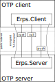

# Erps

## TLS-based Remote Protocol Server



## Installation

The package can be installed by adding `erps` to your list of dependencies in `mix.exs`:

```elixir
def deps do
  [
    {:erps, "~> 0.4.1"}
  ]
end
```

Documentation can be found at [https://hexdocs.pm/erps](https://hexdocs.pm/erps).

